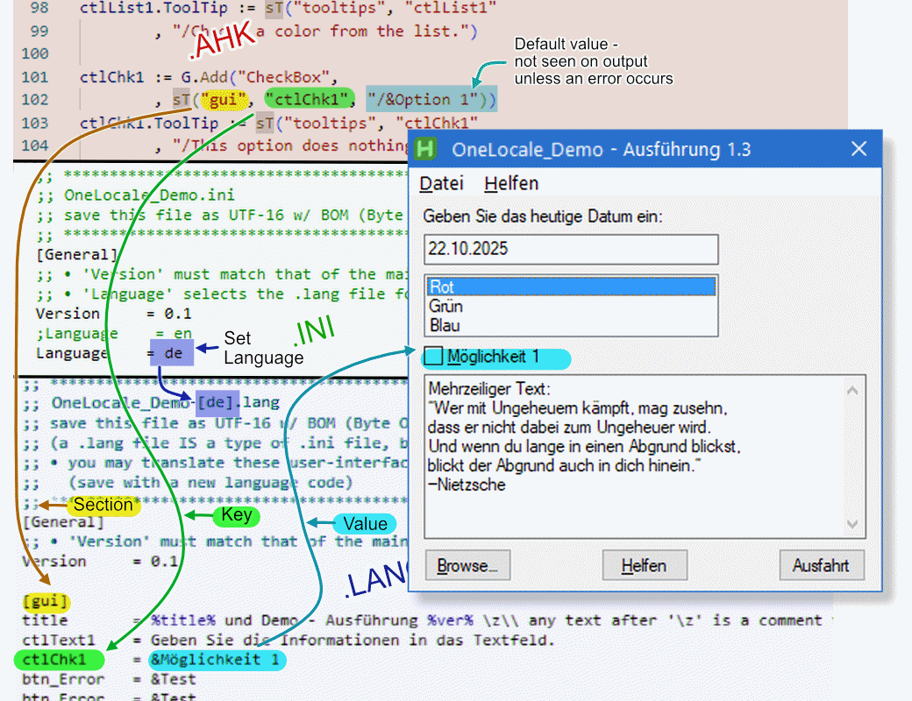

# OneLocale — Simple, powerful i18n for AutoHotkey v2

[](https://opensource.org/license/lgpl-2.1)
[]()


**Write your GUI strings in plain English (or your language of choice) today — add translations tomorrow without touching your code again.**



### What you get

- One-line `sT()` that feels like normal string usage
- Full variable expansion (`%var%` + named parameters)
- Multi-line messages, access keys (`&`), accelerators (`\tCtrl+S`)
- Translator-friendly `.lang` files (just INI with a few escape rules)
- Automatic fallback + optional “baked” maps → single .exe with no external files
- Built-in language-chooser dialog
- Extender system for shared strings across projects

## Quick Start (runs out of the box)

```autohotkey
; MyScript.ahk
#Requires AutoHotkey v2.0
#Include lib/OneLocale.ahk

S_VERSION := "1.0"

locale_info := OneLocale_Init()                 ; reads MyScript.ini → best language
if !locale_info.success {
    MsgBox locale_info.errmsg, , "Icon!"
    ExitApp
}

G := Gui("-SysMenu")
G.Title := sT("gui", "title", "/My Cool App v%ver%", {ver: S_VERSION})

G.AddButton("x50 w100", sT("gui", "btn_save", "/&Save"))
    .OnEvent("Click", (*) => MsgBox "Saved!")
G.AddButton("x50 w100 yp", sT("gui", "btn_quit", "/&Quit"))
    .OnEvent("Click", (*) => ExitApp())

SB := G.AddStatusBar()
SB.SetText(sT("status", "ready", "/Ready"))

G.Show("w200 Center")
return
```

```ini
; MyScript.ini (optional – leave empty for auto-detect)
[general]
;language = de
```

```ini
;MyScript-[en].lang
[gui]
title = My Cool App v%ver%
btn_save = &Save
btn_quit = &Quit

[status]
ready = Ready
```

```ini
;MyScript-[de].lang
[gui]
title    = Mein Cooles Programm v%ver%
btn_save = &Speichern
btn_quit = &Beenden

[status]
ready    = Bereit

[notes]
translator = Grok
```

Now drop `OneLocale.ahk` in a \lib subfolder, and put `MyScript-[en].lang` and `MyScript-[de].lang` in a \lang subfolder. Switch language instantly by editing the ini or using the included **chooser dialog** (not shown here, but seen in this [Demo](./examples/OneLocale_Demo))

## Full Documentation

- [Reference](./docs/reference/) → `OneLocale_Init()`, `sT()`, Dialog, Baker…
- [Notes for Translators](./docs/reference/translator-notes.md) → everything a translator needs
- [Baking languages into the .exe](./docs/reference/baker.md) → (zero external files)

## Why people love it (quietly)

There are a couple of i18n libraries floating around the forums right now.
**OneLocale** simply gives you the most complete, v2-native feature set today — without drama, without legacy baggage, and with the cleanest developer + translator experience I could build.

That’s it.

## Contributing

Bug reports, translations, or just a “this saved me hours” are all very welcome ♥
Open an issue or PR — I usually reply the same day.

## License

GNU Lesser General Public License v2.1 – use commercially, modify, ship in closed-source apps, no problem.
Full text in [LICENSE](./LICENSE).

---

Made with passion (since Feb 2023 → still going strong in 2025) by [raffriff42](https://github.com/raffriff42)
