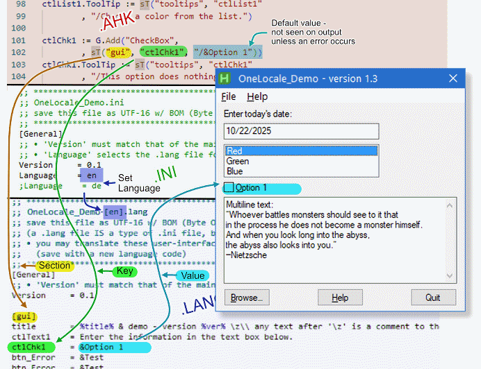
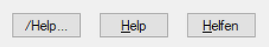
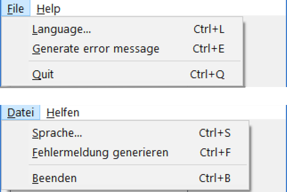
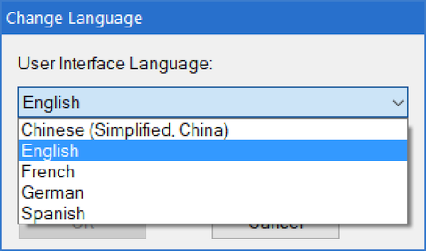

# [_OneLocale&trade;_](https://github.com/raffriff42)

___Simple support for user-interface languages in AutoHotkey___
[](https://opensource.org/license/lgpl-2.1)
By [raffriff42](https://github.com/raffriff42)


Open Source under GNU Lesser General Public License - see [LEGAL](#legal) section.
_This page updated 2025-11-30_

<!-- [TOC] -->

## INTRODUCTION

### What Does OneLocale Do?

__OneLocale__ provides an easier way to support multiple user-interface languages in [AutoHotkey](https://www.autohotkey.com/). The developer (you) creates __rough user-interface text__ ad-hoc and in-place, in your preferred language. You don’t need to bother with the __final__ user-interface text until later.

__OneLocale__ loads the language-specific text at runtime. There is one .LANG file for each supported language.

Translators __do not need to know AutoHotkey__. They can create a translation without interacting with you, the developer.

Even if you don’t plan to support multiple languages, the way __OneLocale__ helps distinguish user-interface text from other string literals in your code is very valuable for code maintenance.

### The OneLocale Concept in a Single GIF



Here are some examples to get us started:

### Example 1 - Adding a Button

Here’s a sample script fragment adding a Button:

```Autohotkey
; MyScript.ahk
G := Gui()
btn_Help := G.Add("Button", "w120", "Help..."))
btn_Help.ToolTip := "View Readme in browser."
```

Here’s the same script fragment using __OneLocale__:

```Autohotkey
; MyScript.ahk - using OneLocale
G := Gui()
btn_Help := G.Add("Button", "w120", sT("gui", "btn_Help", "/Help..."))
;                                   st(  ^section  ^key     ^default)
btn_Help.ToolTip := sT("tooltips", "btn_Help", "/View Readme in browser.")
;                   st(  ^section    ^key        ^default                )
```

An English .LANG file might have these entries for this control:

```dosini
; MyScript-[en].lang
[gui]
btn_Help = &Help

[tooltips]
btn_Help = View the Readme file.
```

And a German .LANG file might have these entries:

```dosini
; MyScript-[de].lang
[gui]
btn_Help = &Helfen

[tooltips]
btn_Help = Lese die readme Datei.
```

The Button text will depend on which .LANG file is loaded.

- If an empty .LANG file is loaded, the left (default) label is shown
- If the English file is loaded, the center label is shown
- If the German file is loaded, the right label is shown



…and obviously, the tooltip will work the same way.

### Example 2 - Adding a Menu Item

Here’s a sample script fragment adding a Menu item:

```Autohotkey
; MyScript.ahk
FileMenu := Menu()
FileMenu.Add(mnu_lang := "&Language...`tCtrl+L", MenuHandler)
```

Here’s the same script fragment using __OneLocale__:

```Autohotkey
; MyScript.ahk - using OneLocale
FileMenu := Menu()
FileMenu.Add(mnu_lang := sT("menu", "language", "/&Language...\tCtrl+L"), MenuHandler)
;                        st( ^section  ^key        ^default            )
```

The .LANG files might look like this:

```dosini
; MyScript-[en].lang
[menu]
language    = &Language...\tCtrl+L
file_test   = &Generate error message\tCtrl+E
file_quit   = &Quit\tCtrl+Q
```

```dosini
; MyScript-[de].lang
[menu]
language    = &Sprache...\tCtrl+S
file_test   = &Fehlermeldung generieren\tCtrl+F
file_quit   = &Beenden\tCtrl+B
```

Here how the menus look in the running application:



___Note___

- Ampersand (`&`) sets the [_Access Key_](https://learn.microsoft.com/en-us/globalization/input/hotkeys-accelerators).

  - Access keys allow menu navigation via underlined letters/numbers.
  - They also work for most UI elements, not just menus (the details are finicky)
<!-- They can be assigned to non-interactive elements (like Labels) to give focus to an associated control, such as an Edit box, Dropdown, or Spinner. -->

- Tab (`\t`) separates menu text and an optional [_Accelerator Key_](https://learn.microsoft.com/en-us/globalization/input/hotkeys-accelerators).

  - Accelerator keys are keyboard shortcuts using `Ctrl`, `Alt`, and/or `Shift` (eg, `Ctrl+S`).
  - The `Win` key _could_ be used, but is normally for system-wide actions.

### Example 3 - an Error Message

```AutoHotkey
; MyScript.ahk
filename := "some-file-name.txt"
msg := "File " filename " not found."
MsgBox(msg)
```

```AutoHotkey
; MyScript.ahk - using OneLocale
filename := "some-file-name.txt"
msg := sT("errors", "bad_path", "/File %path% not found.", {path:filename})
;      st( ^section    ^key        ^default                { ^args       })
MsgBox(msg)
```

We’re using `sT()`’s fourth argument now - `args`, an [Object literal](https://www.autohotkey.com/docs/v2/Objects.htm#object-literal) with names and values to support __variable expansion__. Variable expansion (`%path%` → "_some-file-name.txt_") is a useful feature even if you don’t plan to support multiple languages.

The .LANG files might look like this:

```dosini
; MyScript-[en].lang
[errors]
bad_path = The file '%path%' could not be found.
```

```dosini
; MyScript-[de].lang
[errors]
bad_path = Die Datei '%path%' konnte nicht gefunden werden.
```

The output will depend on which .LANG file is loaded:
with _MyScript-\[__en__].lang_ loaded, the output of this example is

>bad_path: The file 'some-file-name.txt' could not be found.

And with _MyScript-\[__de__].lang_ loaded, the output is

>bad_path: Die Datei 'some-file-name.txt' konnte nicht gefunden werden.

Note how the key `bad_path` is shown to the user __verbatim__; this feature (which works for the `errors` section only) allows tech support to identify the error by a string that __does not change__, regardless of the user’s language. When a user from the other side of the world posts a screen shot, tech support will know which error was triggered.

### sT() - The Central Function

The heart of __OneLocale__ is the `sT()` function, which we saw in the examples above. Here it is again:

```AutoHotkey
msg := sT("errors"                    ; section
        , "bad_path"                  ; key
        , "/File %path% not found."   ; default
        , {path:filename}             ; args object
        , langPath:="")               ; lang path override
```

The __first argument__ (`errors`) is the .LANG file _section_. You can create whatever sections you like; I like to use `gui`, `tooltips`, `errors` and sections for each child window.

The __second argument__ (`bad_path`) is the _key_ or name of a particular string.

The __third argument__ is the _default value_, which is used if the requested key doesn’t have a value.

> A default is useful during initial development as you can see something on the screen, even if the .LANG file is incomplete.
>
> It also serves as a reminder to you, the developer, of the function of this piece of text (and the Gui control or MsgBox it is associated with), and also serves as a starting point for the .LANG file.
>
> I like to prefix the default with `/` as shown, to make it obvious when there is a problem.

The __fourth argument__ is an [Object literal](https://www.autohotkey.com/docs/v2/Objects.htm#object-literal) to support the variable expansion mentioned above.

The __fifth argument__ is for edge cases where you might want to load a second .LANG file for certain strings — perhaps to use `sT()`’s variable expansion on non-UI text, such as a list of command-line templates. If this argument is empty (the default), the .LANG file is pointed to by `g_lang_path`.

`sT()` requires the global variable __`g_lang_path`__, which you must define. `g_lang_path` avoids having to give `sT()` the .LANG path as an argument every time, which would add to code clutter. See the code Example under [Script Initialization](#script-initialization).

### Language Chooser Dialog

If you `#Include` "_OneLocale_Dialog.ahk", your users can select their language with a dialog box — a __Language Chooser__. It looks in your Language directory for all matching .LANG files — so if your user downloads one from the Internet and puts it in that folder, the dialog loads it into a Listbox:



### Localization Utilities

If you `#Include` "_OneLocale_Utils.ahk" you get helpful routines to localize things like __Time__, __Date__, __Currency__ & __Number__ formats.
The functions are listed below.

- __FormatExCurrency__(sValue, sLocaleName)
- __FormatExDate__(sDate, sFormat, sLocaleName)
- __FormatExDuration__(sDuration, sFormat, sLocaleName)
- __FormatExNumber__(sValue, sLocaleName)
- __FormatExTime__(sTime, sFormat, sLocaleName)

<!-- The output of `GetLanguagesTable()` is presented here: [Language-data-[MS-LCID]](../data/Language-data-[MS-LCID].html) --><!-- TODO -->

---

## SETTING UP

### The .INI File and the Language ID

Your script needs an .INI file. It probably has one already.  To make use of __OneLocale__, it requires the following section and entry:

```dosini
; MyScript.ini
[general]
language = (a Language ID)
```

The Language ID can be any name you like; [ISO 639-1 2-letter codes](https://en.wikipedia.org/wiki/List_of_ISO_639-1_codes) are suggested (`en` for English, `fr` for French, `de` for German, etc.). To distinguish British English from American English, or Simplified Chinese from Chinese for example, use Microsoft’s [language tag table](https://learn.microsoft.com/en-us/openspecs/windows_protocols/ms-lcid/a9eac961-e77d-41a6-90a5-ce1a8b0cdb9c). You can also use [LCID codes](https://www.autohotkey.com/docs/v2/misc/Languages.htm) such as returned by `A_Language`, but they’re not as readable for humans.

### #Includes

OneLocale needs to be included in your script.

```AutoHotkey
; MyScript.ahk
; language support
Include "_OneLocale.ahk"       ; required
Include "_OneLocale_Dialog.ahk" ; optional
;#Include "_OneLocale_Utils.ahk"  ; optional
```

### Directory Structure

The recommended directory structure is this:

```txt
Script-Folder
  |-- Lang
  |-- Docs
  |     |-- assets
```

- '`Script-Folder`' contains your .AHK and/or .EXE, your .INI, etc.
- '`Lang`' contains .LANG files. It can contain other files too if you want.
- '`Docs`' is for documentation — .TXT, .MD, .HTML, etc. Images and .CSS files
  _should_ — but aren’t required to — go in a subfolder like '`Docs\assets`'.

If you want, you can put all the files just mentioned directly in the Script folder; we’ll see how in the next section.

### Script initialization

`OneLocale_Init()` must be inserted in the script before any `sT()` calls.

#### Example 1 - default arguments

```AutoHotkey
; MyScript.ahk
;OneLocale_Init(optional_args:="")

locale_info := OneLocale_Init()
if (!locale_info.success) {
    MsgBox(locale_info.errmsg, S_TITLE, "icon!")
    ExitApp
}
g_lang_path  := locale_info.langPath ; 'g_lang_path' is required by sT()
g_ini_path   := locale_info.iniPath  ; optional - for your convenience
g_html_path  := locale_info.docsPath ;   ''        ''  ''      ''
```

The default arguments suffice _IF_ ( assuming `MyScript` is replaced with your script name, and `/TAG/` means the active language, like "en" )

- The .INI file is named `MyScript.ini` and is located in `A_ScriptDir`
- The .LANG file is named `MyScript-[/TAG/].lang` and is located in
 `A_ScriptDir` `\lang`
- The .HTML file (if present) is named `MyScript-[/TAG/].html` and is located in
 `A_ScriptDir` `\docs`
- The language ID is specified in the .INI file or is equal to `A_Language`

#### Example 2 - no .LANG file

If you want your .INI to also hold your UI text, eliminating .LANG files (most useful for very simple scripts where you don’t want to bother with a separate .LANG file just yet, but want be ready for future expansion), you would set `noLangFile` (an optional argument) to `true`.

```AutoHotkey
locale_info := OneLocale_Init( {noLangFile:true} )
```

See [Example - no .LANG File](#example-2---no-lang-file) below.

#### Example 3 - no \docs subdirectory

If you want to put the help file in `A_ScriptDir`, eliminating the
"\docs" subdirectory, you would clear `sDocsFolder`:

```autohotkey
locale_info := OneLocale_Init( {sDocsFolder:""} )
```

#### Example 4 - set custom .INI and .LANG file base namea

If your Script name (`A_ScriptName` without the extension) doesn’t match your .INI file name, you would set `sName`. This sets the name of your .INI, and the base names of your .LANG and documentation files. Useful if you want to try a temporary script like `MyScript_TEST.ahk`

```AutoHotkey
locale_info := OneLocale_Init( {sName:"MyScript"} )
```

#### Example 5 - set custom help file name & extension

If your help file is _not_ named `MyScript-[/TAG/].htmml` as described above, like `README-/TAG/.asc` for example, you would set `sDocName` and `sDocExt`:

```AutoHotkey
locale_info := OneLocale_Init( {sDocName:"README-/TAG/", sDocExt:"asc"} )
```

If your documentation is in one language only, don’t incude `/TAG/`:

```AutoHotkey
locale_info := OneLocale_Init( {sDocName:"README", sDocExt:"asc"} )
```

### A Stub .LANG File

__OneLocale__ requires a .LANG file: if the Language ID is "__en__", and your script is named _MyScript_, by default `OneLocale_Init()` would look for a file named _MyScript-\[en].lang_. Make sure the Language ID in your .INI file matches the language code in your .LANG file’s name.

A .LANG file is __actually an .ini file__ with a different extension. This lets you set up custom file associations and editor preferences for both types of file. All .INI and .LANG files are accessed with AutoHotkey [IniRead](https://www.autohotkey.com/docs/v2/lib/IniRead.htm#Remarks). You should familiarize yourself with its ‘quirks and features’ — most importantly that you must save a .LANG file as [UTF-16](https://en.wikipedia.org/wiki/UTF-16) with BOM [(Byte Order Mark)](https://en.wikipedia.org/wiki/Byte_order_mark) to preserve Unicode characters.

You don’t need to add anything to the file for now. Your script will work just fine with an empty .LANG file IF you have set default UI text in your code as we showed [earlier](#example-1---adding-a-button).

### User-Interface Text

Here is where you go through your code and locate all the user-interface text bits (window and button captions, text controls, checkbox labels, error messages, ...) and wrap them in `sT()` calls:

```AutoHotkey
;; before
ctlChk1 := G.Add("CheckBox", , "&Option 1")
;; after
ctlChk1 := G.Add("CheckBox", , sT("gui", "ctlChk1", "/&Option 1"))
;;                                 ^SECTION  ^KEY       ^DEFAULT VALUE
```

You need to tell `sT()` the _section_ and the _key_. (Maybe take another look at the [GIF](#the-onelocale-concept-in-a-single-gif)).

Common __section names__ are `gui` (GUI elements in the main window), `tooltips` (tooltips in the main window), and `errors` (error messages).

> Each __child window__ should have its own sections, like `dialog1_gui`, `dialog1_tooltips`
and maybe `dialog1_errors`. It’s up to you.

The __key names__ are generally the same or close to the control’s name, like in this example. You can re-use the same key names in different sections.

Then you simply __copy your existing UI text__ into the __Default__ argument. Again, I like to prefix the default with `/` as shown, to make it obvious when there is a problem, like a missing section/key/value in the .LANG file — and they will ALL be missing at this point, because your .LANG file is just a stub.

Run your script, and all your UI text will appear just as it was but with `/` prefixes, showing that __OneLocale__ is working, but there is no .LANG data as yet.

### Completing The .LANG File

This part is surprisingly easy - the information you need to build the .LANG file is in your code. All you need to do is copy and paste. (It goes so quickly that I’m not very motivated to write something to automate the process.)<!-- TODO -->

```AutoHotkey
; MyScript.ahk
ctlChk1 := G.Add("CheckBox",
        , sT("gui", "ctlChk1", "/&Option 1"))
```

```dosini
; MyScript-[en].lang
[gui]
ctlChk1 = &Option 1
```

#### Multi-line messages

For messages with line breaks, you can insert `\n`’s as needed. However, longer messages get a bit unwieldy. For example (from something I’m working on):

```dosini
;; Long message method #1 - get key value
[refresh]
Failed = THERE MAY BE A PROBLEM: \n\n You requested %req_fps%Hz refresh rate, but actual \n refresh rate is %new_fps%Hz.
```

You may sometimes want to give those messages their own sections:

```dosini
;; Long message method #2 - get entire section
[refresh_failed]
THERE MAY BE A PROBLEM: \n
You requested %req_fps%Hz refresh rate, but actual
refresh rate is %new_fps%Hz.
```

The output from the above (using either method, and given appropriate data for `req_fps` and `new_fps`) looks like this:

>THERE MAY BE A PROBLEM:
>
>You requested 90Hz refresh rate, but actual
>refresh rate is 60Hz.

The second .LANG file entry is easier to write as it looks more like the final output.

If you want a line break in your .LANG file but not in your output, use `\w` at the end of the line (this lets the Gui element handle Word Wrap)

Okay, you’re basically done. You have a complete .LANG file! Now you can:

- Take a fresh look at your UI text, now that it’s separated from your code.
- Perhaps simplify your code by taking advantage of `sT()`’s variable expansion.
- Begin working on translations - remember to name each one with a language code.

---

## YOUR SECOND .LANG FILE

### Instructions for Translators

__(1)__ Open the first .LANG file, save with a new name

Name must be of the form '_MyScript-\[_`XX`_].lang_', where `XX` is a language identifier. This language identifier can be anything you like, but [ISO 639-1 codes](https://en.wikipedia.org/wiki/List_of_ISO_639-1_codes) are suggested (`en` for English, `fr` for French, `de` for German, etc). For sublanguages (American English, Simplified Chinese), use Microsoft’s [language tag table](https://learn.microsoft.com/en-us/openspecs/windows_protocols/ms-lcid/a9eac961-e77d-41a6-90a5-ce1a8b0cdb9c).

Some examples:

>'_MyScript-\[fr].lang_'   (French)
>'_MyScript-\[de].lang_'  (German)
>'_MyScript-\[es].lang_'   (Spanish)
>'_MyScript-\[en-gb].lang_' (British English)
>'_MyScript-\[en-us].lang_' (American English)

__(2)__ Translate the user-interface strings

For example, let’s translate a .LANG file section to French.
I’m using Google Translate \(_this paragraph was written in 2023_) because I don’t speak the language.
Note, some rephrasing and abbreviations are used to control length.

> :point_right::point_right: In 2025, it’s preferable to use an __AI__ to do your translations.
> Once they understand the [rules](OneLocale-notes-for-translators.html), they can handle a whole .LANG file
> at once instead of line-by-line.

### Some helpful rules

- Ignore any text to the right of `\z` which starts a comment to the translator. You may add your own comments. This text will not appear to the user.
- Don’t change any _keys_ — words surrounded with `%` marks.
- Translate only the part to the right of the `=` (equals) sign —
  except for [Multi-line](#multi-line-messages) sections.

  - Multi-line sections are read and displayed as a whole.
  - They won’t have `=` on every line like single-line sections.
  - Line breaks are significant.
  - For indented text, use `\t` (Tabs) - spaces won’t work.
  - For blank lines, use `\n` (newlines)
- Try not to let translated strings get much longer than the originals.
  (this may or may not be important, depending on the UI)

  - Error messages are not limited by this restriction quite as much.
- Gui elements like buttons, labels and menus can have _Access Keys_
  - Choose appropriate keys for your language
  - Make them unique within a Gui window, if possible
- Menus can have _Accelerators_
  - Choose appropriate accelerators for your language
  - Repect your language’s standard keys for Open, Copy, Paste etc.
  - Make them unique within a GUI window, if possible
    (dialog boxes can re-use accelerators)

```dosini
; MyScript-[en].lang (INPUT)
[gui]
Prompt        = &Select new Resolution:
Mode_Native   = (native) \z(Native resolution for a monitor)
Button_OK     = OK
Button_Cancel = Cancel
Post_Change   = Monitor %id% New Resolution %wid% x %hgt% @ %refresh%
```

```dosini
; MyScript-[fr].lang (OUTPUT)
[gui]
Prompt        = &Nouvelle résolution:
Mode_Native   = (natif)
Button_OK     = OK \z Default button - no access key needed
Button_Cancel = Annuler \z Cancel button - no access key needed
Post_Change   = Moniteur %id% nouvelle rés. %wid% × %hgt% @ %refresh%
```

__(3)__ Save the file as UTF-16 with BOM (Byte Order Mark)

To use the new language file, place it in your .LANG folder and either update `Language=` in _MyScript.ini_ to your language code, or if you have implemented the [Language Dialog](./reference/chooser.md), let your users select it themselves.

__These notes are summarized__ in the short document [_OneLocale - Notes for Translators_](./reference/translator-notes.md).

---

## HISTORY

__OneLocale__ was first created in February 2023, and has been slowly refined as it was used in many of my personal projects.

It is a complete rework of my 2013 __NetText__ [(sourceforge)](https://sourceforge.net/projects/nettext/), which was based on my 2011 __GetText__ [(sourceforge)](https://sourceforge.net/p/filesearchclassic/code/HEAD/tree/trunk/vb6/lindsaybigelow/GetText/), which was inspired by GNU’s 1995 __gettext__ [(gnu.org)](https://www.gnu.org/software/gettext/).

## LEGAL

__OneLocale&trade;__ is free software; you can redistribute it and/or modify it under the terms of the __GNU Lesser General Public License__ as published by the Free Software Foundation; either [version 2.1 of the License](https://opensource.org/license/lgpl-2-1), or (at your option) any later version.

This library is distributed in the hope that it will be useful, but WITHOUT ANY WARRANTY; without even the implied warranty of MERCHANTABILITY or FITNESS FOR A PARTICULAR PURPOSE. See the GNU Lesser General Public License for more details.

I believe that unless otherwise attributed in the source, this AutoHotkey code is original (other than sample code from the [Documentation](https://www.autohotkey.com/docs/v2/lib/Gui.htm#Examples))

Documentation &copy; 2025 [raffriff42](https://github.com/raffriff42) [CC BY 4.0](https://creativecommons.org/licenses/by/4.0/)  

Any sample code demonstrating usage is public domain, marked [CC0 1.0](https://creativecommons.org/publicdomain/zero/1.0/)

Icon adapted from Wikimedia Commons [Earth_icon_2.png](https://commons.wikimedia.org/wiki/File:Earth_icon_2.png), marked [CC0 1.0](https://creativecommons.org/publicdomain/zero/1.0/)

(end)
