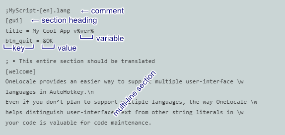

# OneLocale – Notes for Translators

Thank you for helping make someone’s app feel native!

### Save as a new file

- Before starting, save your work as a new file.
- Save as *UTF-16 LE with BOM* to preserve Unicode.
This is a restriction of all `.ini` files — a `.lang` file *IS* a type of `.ini` file.
- Save with the proper language *tag*
- For example, a French translation of
  - `MyScript-[en].lang` would be saved as
  - `MyScript-[fr].lang`

#### *Language tags*

- Basic language tags are found at [List of ISO 639-1 Codes](https://en.wikipedia.org/wiki/List_of_ISO_639-1_codes) (Wikipedia).
- All 436 valid tags are listed in this [Microsoft Document](https://learn.microsoft.com/en-us/openspecs/windows_protocols/ms-lcid/a9eac961-e77d-41a6-90a5-ce1a8b0cdb9c) (scroll down to Table 2).

👉 It's easiest to use [OneLocale_FindLangID](../../utilities/OneLocale_FindLangID/) to find tags by partial language name. As shown below for example, entering "spa…" or "esp…" lists all Spanish dialects:

### Important Rules

- Never change a *key* — anything to the left of '`=`'.
- Never change a *variable* — words inside `%percent signs%`
- When we talk about a *Section* we mean a part beginning with a `[section heading]`

*Parts of a .lang file:*

### Formatting

- '`\n`' forces a new line
- Anything after '`\z`' is a comment and will never appear to the user:
  - Maybe a comment *to* you, to give helpful context.
  - Maybe a comment *from* you, to the developer or the next translator.
- To show a literal (not marking a variable) '`%`', write '`\%`'.

> 👉 Watch out for translated strings becoming **too long to display properly**. Experiment. Run the app and see how it looks. Try to re-word your translation to make it fit in the space available.
>
> As a rule of thumb, messages should be **no more than ~120% longer than the base language** - although this depends on how much room the developer gave you.
>
> If your shortened translation sacrifices important meaning, you can explain further in the element's **Tooltip**, if it has one.

#### Menus

- Ampersand ('`&`') sets the *Access Key* (e.g. '`&Cancel`')
  - Choose an appropriate key for your language.
  - Make them unique within a menu, if possible.
  - To show literal '`&`' without the underline, use '`&&`' (e.g. '`Cats && Dogs`')
- Tab (`\t`) separates menu *text* and menu *Accelerator* (hotkey) (e.g. '`&Save \t Ctrl+S`')
  - Choose an appropriate hotkey for your language.
  - Make them unique within a GUI window (each dialog window can have its own hotkeys)
- Discuss with the developer as needed.

See Microsoft’s [*Keyboard Shortcuts and Localization*](https://learn.microsoft.com/en-us/globalization/input/hotkeys-accelerators) for details of both Access Keys and Accelerators.

#### GUI elements

- Unlike Menus, Gui elements (Buttons, Checkboxes, Labels, etc.) don't have hotkeys.
- Ampersand (`&`) sets the Access Key (e.g. '`Save &As...`')
  - Choose the appropriate key for your language.
  - Make them unique within a GUI window, if possible.
  - To show literal '`&`' without the underline, use '`&&`'

#### Multi-line sections

Multi-line sections look different in a .lang file, because they don't have '`=`' on every line like normal sections.

- The entire section should be translated (except  `%variables%`)
- Indent text with '`\t`'.
- Blank lines are ignored on input; use '`\n`' if you need an empty line on output.
- Remove line breaks (allow word wrap) with `\w` at the start or end of line.
- Pay attention to display limits. Test often. Discuss problems with the developer.

#### Error messages

- Assuming the error message is to be shown in a standard Message Box, length isn't as critical as it is for Gui elements, as a Message Box can grow somewhat.
- Test often. As most error messages are rarely displayed, the developer should probably give you a **helper app** that can display every error message as it would appear in the final product.

#### Tooltips

- There are no access keys or accelerators.
- No length restriction — tooltips can grow to display a *lot* of text.

Questions? Open an issue on the GitHub repo — we’re friendly.

---

### The 2025 way

👉 Just give the entire .lang file to Grok, Claude or ChatGPT and say:
*Translate this AutoHotkey OneLocale language file to German. Never touch keys or %variables%*
and attach a copy of these Notes.

A good AI chatbot will give you a near-perfect file in seconds. You only need to skim for tone.

(Yes, this is how most translations will happen from now on.) 😀

– the OneLocale team (and Grok says hi)

Back to [README](../../README.md)
